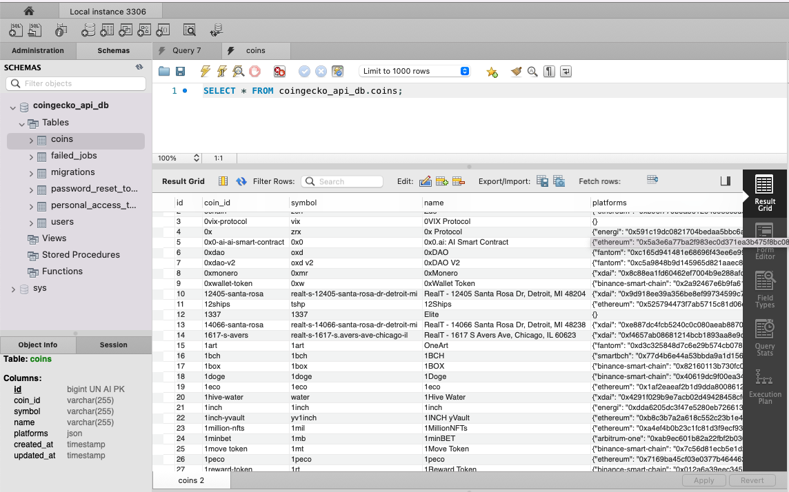
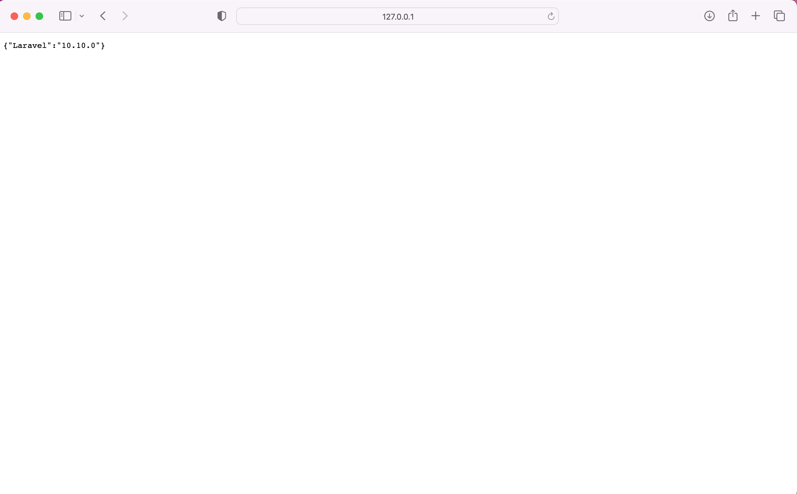
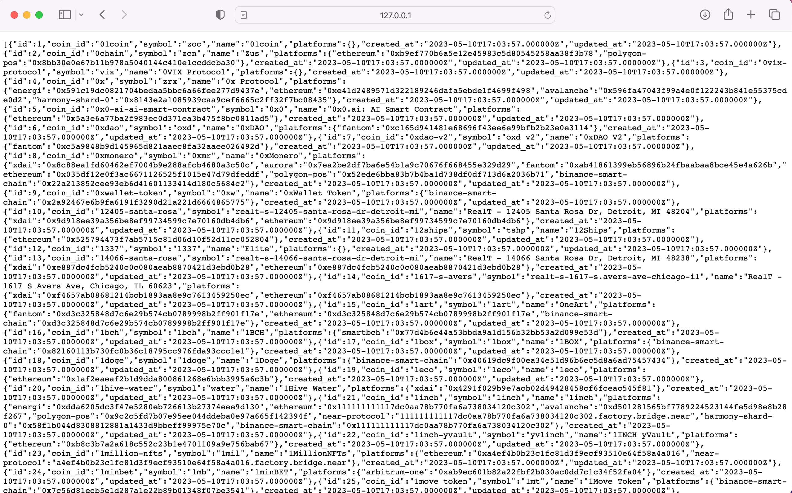
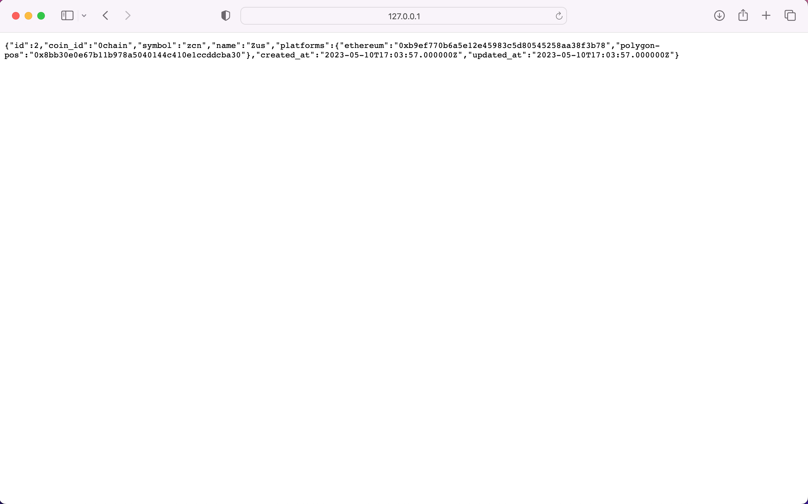

# CoinGecko-API

This project is built with `Laravel v10.10.0` and `PHP v8.2.5`.

> About the project:

Simple artisan command that fetches data from the [provided Coingecko API endpoint](https://api.coingecko.com/api/v3/coins/list?include_platform=true) and stores it in a database.

> Coingecko API Documentation: `https://www.coingecko.com/en/api/documentation`

## Requirements

Make sure you have `PHP` and `composer` installed and configured on your system.

## Setup and Running

```bash

# download/setup the project on your machine.
$ git clone 

$ cd /projects/coingecko-api

# install required packages
$ composer install

# create databases and run migrations.
$ php artisan migrate


# Run the artisan command to fetch data from coingecko api and store into db.
$ php artisan fetch:coingecko


# Run the app - Check the Live API and all coins data via below mentioned API endpoints.
$ php artisan serve 

```

> `$ php artisan serve` command will run the app and expose to http://127.0.0.1:8000/ address by default

You may also try below API endpoinds to see the data right in favourite web browser or API client.

```bash
GET http://127.0.0.1:8000/api/coins

GET http://127.0.0.1:8000/api/coins/{coin_id}
```

## What's more

Sample database schema script could be found in [db_schema.sql](./db_schema.sql)


## Demo screenshots

### Data Fetch and stored in DB using command 

> `$ php artisan fetch:coingecko`



### Running app in browser

> `$ php artisan serve` -- GET `http://127.0.0.1:8000/`




### /api/coins

> `$ php artisan serve` -- GET `http://127.0.0.1:8000/api/coins`



### /api/coins/0chain

> `$ php artisan serve` -- GET `http://127.0.0.1:8000/api/coins/0chain`




## About me...

[Narain M.](https://github.com/narainsagar)
